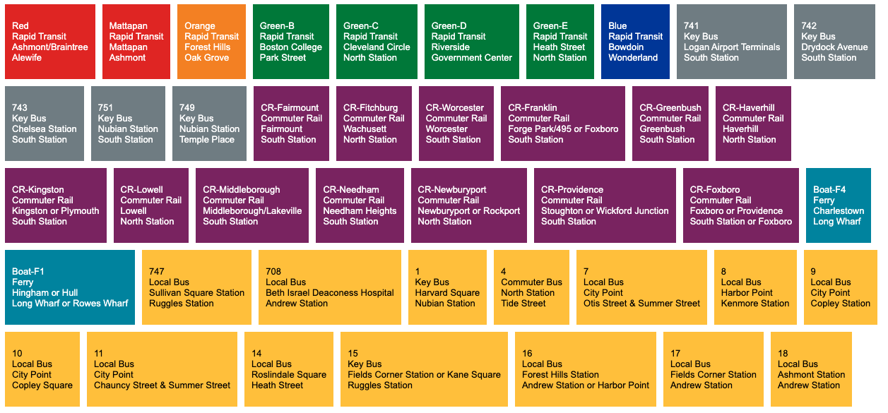
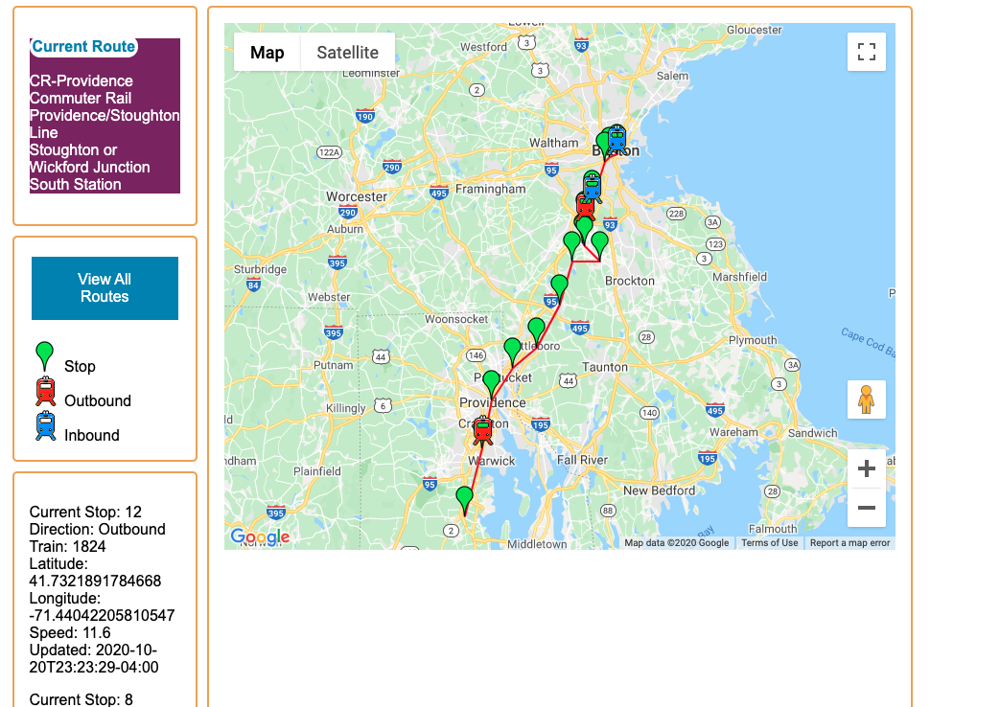

# ride

## Before you begin

You will need to install Docker and docker-compose

## clone the app

```git clone git@github.com:eparker71/ride.git```

## configure settings

You will need to add your own settings

create a file called `secure.py` in the same folder as `settings.py` and add the following lines.

```python
secure_settings = {
    "DJANGO_KEY" : "<your django secret key>",
    "API_KEY" : "<mbta api key>",
    "MAP_KEY" : "<google map api key>",
}
```

The `DJANGO_KEY` is the `SECRET_KEY` found in your settings file when you create a new django app.
You can generate a new key by creating a new django app and copying the key.

The `API_KEY` is the api key provided by the MBTA. You can get a key from the [MBTA developers site](https://www.mbta.com/developers/v3-api).

The `MAP_KEY` is the google map api key used to render google maps. You can get a google map key from the [Google Map Platform site](https://developers.google.com/maps/documentation/embed/get-api-key)

## How to run

```docker-compose up```

## Main Screen




